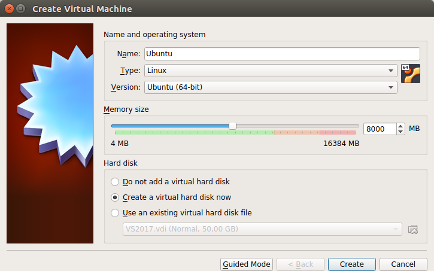
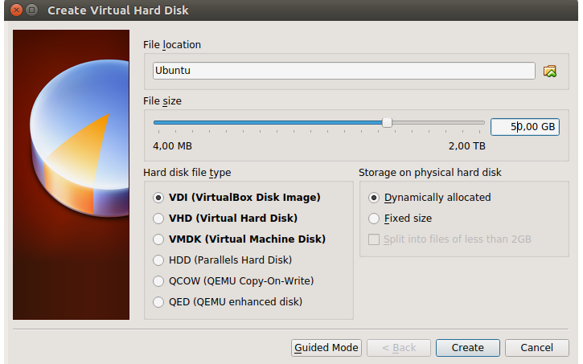
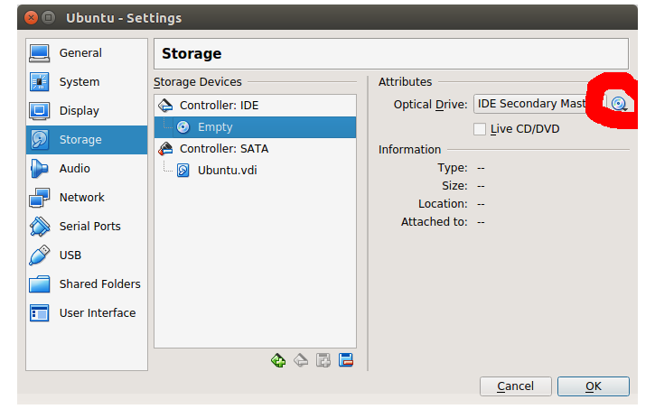

# Installing VirtualBox
1. Download Ubuntu 16.04 (64-bit) image from [here](https://www.ubuntu.com/download/desktop)  
2. Download package from [here](http://www.oracle.com/technetwork/server-storage/virtualbox/downloads/index.html#vbox)  
3. Create new Virtual Machine with Linux OS (Ubuntu 64-bit)  

4. Give your Virtual Machine at least 20 GB virtual hard disk space.  

5. Right click on created image and select Ubuntu 16.04 (64-bit) iso in dropdown.  

6. Run the Ubuntu installation.
